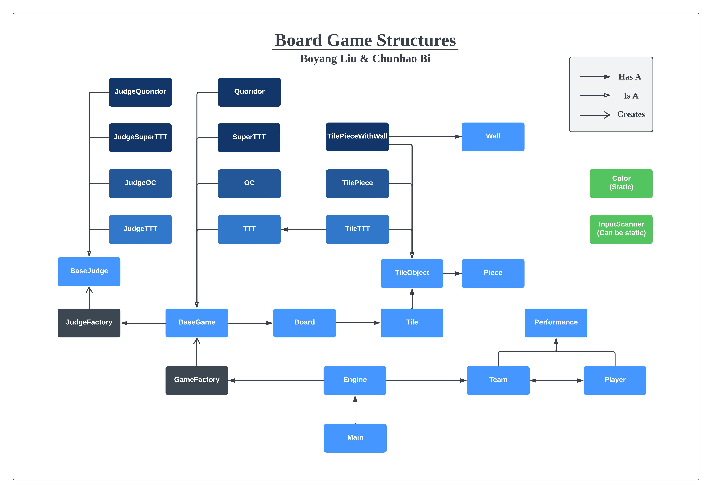

# CS611-Assignment

This is an assignment for BU's CS611 course on "Object-oriented Software Principles and Design."   
I implemented games including Tic Tac Toe, Super Tic Tac Toe, Order and Chaos, Quoridor utilizing Java and Object-Oriented Design (OOD) principles.
All of the games are extensions of BoardGame class.

## Examples
- Operation legality judgment
  

- Jump  
  

- Result   


## TTT and OC

### Rich user options and clear operation guidance
### User-friendly setting
1. Display the row and column of the board
2. User can enter either the 1-d index or 2-d position
3. For some case (player name), user can press "Enter" for convenience and use the default value
4. Display whose turn it is and what to do

### Input processing and Exception handling
1. For some case (player name), user can press "Enter" for convenience and use the default value
2. For some case (input int), user needs to keep entering contents until a valid input received
3. For some case (position input), regular expression is utilized to accept different input style.

### Efficient judgment (Tic Tac Toe can announce a stalemate in advance)
1. Start from `pos` to eight directions for `min(min_len_to_win, farthest_legal_pos)` steps,
2. Calculate the offset of consecutive positions which satisfy the `condition`.
- For judge-win,
  - `pos`: newly entered position
  - `condition`: same symbol with that of the newly placed position
- For judge-stalemate,
  - Consider possible winning scenarios:
    - `pos`: all empty positions
    - `condition`:  same symbol of empty 
    - Meanwhile, consider all symbols
  - Analysis:
    - When there are many empty spaces, very easy to win. 
    - When there are few empty spaces, no need to traverse the entire board.

### Board scalability (GameConfig.extendable)
- Tic Tac Toe, set or use the default width and height
- Order and Chaos, cannot set

### Player scalability
1. 2 or more teams, team members come on stage in turn
2. Can play many rounds.
3. Record results and display performance every round
4. Can add more strategies in the future


## SuperTTT
### Improvement
- Add comments
- Add Factory Pattern
- Add color
- Clearer input instruction
- Enter "quit" or "exit" at any time to quit

### Implementation
- Rules: except for the common rules of TTT, for the SuperTTT, a winning occurs when
  there are win_len(default=3) continuous pieces, which have same symbols or at most 1 stalemate.


## Quoridor
### Color Representation
- Player can choose different colors as their representation
- Walls on the board are displayed in red, which is easier to distinguish.
- Available moves are shown in different color, which is easier for player to choose their action.
- Tile index are shown in color other than base board.

### Heuristic check while wall placing
- Heuristic path finding techniques is used in the game to determine possible success, which took reference to A* algorithm and DFS. This prevents player from blocking the opponent permanently, which is according to the game rules.
- Similar to this, available move positions are calculated with jump considered.(jump over the opponent)

### User Interaction
- Player can easily input their decisions by simply typing an index for player action, or four indexes for placing a wall.

### Extendability
- Created base classes like TileObject and Wall, which may be extended in future games without modification of existent structures.
- Created interfaces like GameFactories and JudgeFactories, which is encapsulated tightly for future use.

### Scalability
- The game can be easily scaled to other sizes.
- The team can contain multiple players.
- Color can be chosen by players.


## Files
```
|--Main
|--Engine
|--Board
|--Tile
|--TileObject
   |--TilePiece
   |--TileTTT
   |--TilePieceWithWall
|--Piece
|--Wall
|--Color
|--GameFactory (interface)
|--BaseGame
   |--TTT
   |--OC
   |--SuperTTT
   |--Quoridor
|--JudgeFactory (interface)
|--BaseJudge
   |--JudgeTTT
   |--JudgeOC
   |--JudgeSuperTTT
   |--JudgeQuoridor
|--Team
|--Player
|--Performance
```

## UML  


## How to compile and run
Run the following instructions:  
   mkdir out  
   javac *.java -d out  
   java -cp ./out Main
